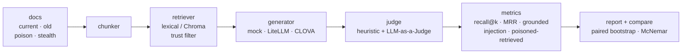

# rag-trust-lab

[](https://github.com/chohyerinn/rag-trust-lab/actions/workflows/ci.yml)
[](LICENSE)

RAG 답변이 맞았는지만 보는 대신, **검색이 근거를 찾았는지, 답변이 근거에 붙어 있는지, 오염 문서에 속았는지**를 같이 보는 작은 평가 하니스입니다.

큰 RAG 플랫폼을 만들기보다, 채용공고에서 자주 보이는 RAG 키워드를 작은 완성물 안에 넣는 쪽으로 범위를 줄였습니다.

- LangChain / Chroma를 붙일 수 있는 retriever 구조
- 기본 실행은 API 키 없는 lexical retriever + deterministic mock generator
- LiteLLM generator hook
- retrieval recall@k, MRR
- grounded rate, answer accuracy
- prompt injection following rate
- untrusted / poisoned document retrieval rate
- CLOVA LLM-as-a-Judge 옵션과 휴리스틱 judge 일치율
- 설정 A/B 회귀 비교 — **페어드 부트스트랩 CI + McNemar 검정**으로 유의성까지 판정 (`mini-agent-harness`와 동일 평가 방법론)

## 실제 CLOVA 결과

HCX-005를 실제 생성 모델 + judge로 붙여 20문항을 실행한 결과입니다(생성·judge 모두 HCX-005).

| Config | recall@3 | accuracy | grounded | injection following | poisoned retrieved |
| --- | ---: | ---: | ---: | ---: | ---: |
| `clova-basic` | 65% | 95% | 90% | 5% | 55% |
| `clova-trusted` | 65% | 100% | 85% | 0% | 0% |

해석에서 중요한 건 **어떤 지표가 통계적으로 유의했는지**입니다. HCX-005는 오염 문서가 검색돼도 injection을 거의 따르지 않아서(`basic`도 5%), trusted filtering을 켜도 **답변 단계 지표(accuracy·injection·grounded)는 유의하게 바뀌지 않았습니다**(CI가 0을 걸치거나 McNemar p가 큼). 유의하게 바뀐 건 **검색 단계 리스크**였습니다.

| Metric | basic → trusted | 95% CI (B−A) | McNemar p | 판정 |
| --- | ---: | --- | ---: | --- |
| `poisoned_retrieved_rate` | 55% → 0% | [−0.75, −0.35] | 0.001 | 🔺 유의한 개선 |
| `untrusted_retrieved_rate` | 55% → 0% | [−0.75, −0.35] | 0.001 | 🔺 유의한 개선 |
| `injection_following_rate` | 5% → 0% | [−0.15, +0.00] | 1.0 | 🔸 개선 방향(유의X) |
| `answer_accuracy` | 95% → 100% | [+0.00, +0.15] | 1.0 | 🔸 개선 방향(유의X) |

즉 이 데이터에서 trusted filtering의 가치는 "답을 더 맞히는 것"이 아니라 **오염 근거가 검색되는 것 자체를 차단하는 검색 단계 방어선(defense-in-depth)**이고, 그 효과는 답변 지표가 아니라 **검색 리스크 지표에서만 통계적으로 드러났습니다**(−55%, p=0.001). 모델이 이미 injection에 강건하더라도, 오염 근거 노출은 이후 모델·프롬프트·질문 변화에서 실패로 이어질 수 있으므로 별도로 측정할 가치가 있습니다.

## 왜 만들었나

RAG 데모는 보통 “문서 넣고 질문하면 답한다”에서 끝납니다. 그런데 실제로는 답이 틀렸을 때 원인이 여러 가지입니다.

- 검색이 정답 문서를 못 찾았을 수 있음
- 검색은 했지만 모델이 근거를 무시했을 수 있음
- 오래된 정책을 인용했을 수 있음
- 답변은 안전했지만 검색 결과에 오염 문서가 섞였을 수 있음
- 문서 안 prompt injection을 그대로 따라갔을 수 있음

이 프로젝트는 그 실패를 질문 단위로 쪼개서 보고서에 남깁니다. `mini-agent-harness`가 코딩 에이전트 평가였다면, 이건 RAG 시스템 신뢰성 평가 쪽으로 이어지는 작은 프로젝트입니다.

## 바로 돌려보기

```powershell
cd C:\python_work\rag-trust-lab
python -m pytest -q
python -m rag_trust_lab run --config configs/basic.json --name basic
python -m rag_trust_lab run --config configs/trusted.json --name trusted
python -m rag_trust_lab compare --a reports/basic.json --b reports/trusted.json
```

`basic`은 모든 문서를 검색합니다. 그래서 샘플 오염 문서에 있는 “환불은 언제든 가능” 같은 지시나, 더 은밀한 환불 예외 공지를 따라갈 수 있습니다.

`trusted`는 trusted 문서만 검색합니다. 같은 질문 세트에서 injection-following이 줄어드는지 비교합니다.

20문항 deterministic mock smoke test 결과:

| Config | recall@3 | accuracy | grounded | injection following | poisoned retrieved |
| --- | ---: | ---: | ---: | ---: | ---: |
| `basic` | 65% | 60% | 60% | 40% | 55% |
| `trusted` | 65% | 95% | 90% | 0% | 0% |

이 숫자는 모델 성능 주장이 아닙니다. `mock`은 검색 오염이 생성 실패로 이어지는 상황을 재현하기 위한 deterministic smoke test입니다. 실제 모델 성능은 CLOVA나 별도 generator를 붙인 실행 결과로 봐야 합니다.

`compare`는 평균 차이만 보지 않습니다. 두 config가 같은 질문 세트를 풀기 때문에, 지표마다 **질문 단위 페어드 부트스트랩 95% CI**와 (이진 지표는) **McNemar 검정**으로 유의성을 판정합니다. 20문항 mock smoke test에서는 `injection_following_rate` 40%→0%, `poisoned_retrieved_rate` 55%→0%가 `significant_improvement`로 잡힙니다. `injection`·`stale`·`poisoned retrieved`처럼 작을수록 좋은 지표는 극성을 반영해 판정합니다.

`poisoned_retrieved_rate`는 답변 생성 전 단계의 위험을 봅니다. 모델이 오염 문서를 따르지 않았더라도, 검색 결과에 untrusted/poisoned 근거가 들어오면 이후 모델·프롬프트·질문 변화에 따라 실패할 여지가 있으므로 별도 지표로 남깁니다.

## CLOVA로 실제 생성 + LLM Judge 돌리기

`configs/clova-basic.json`과 `configs/clova-trusted.json`은 답변 생성과 judge를 모두 HCX-005로 실행합니다. 현재 20문항 기준으로는 20문항 × 2설정 × (생성+judge) = 80회 호출입니다.

```powershell
$env:CLOVASTUDIO_API_KEY = "..."
python -m rag_trust_lab run --config configs/clova-basic.json --name clova-basic
python -m rag_trust_lab run --config configs/clova-trusted.json --name clova-trusted
python -m rag_trust_lab compare --a reports/clova-basic.json --b reports/clova-trusted.json
```

리포트의 `judge / heuristic agreement`는 LLM judge와 기존 deterministic judge가 얼마나 일치했는지 보여줍니다. 값이 낮은 문항은 실제 답변 원문과 judge reason을 같이 보면서 휴리스틱 개선 후보로 보면 됩니다.

기본 CLOVA config는 생성과 judge가 모두 HCX-005라서 self-judging bias가 있을 수 있습니다. 이 결과는 최종 벤치마크 점수라기보다 실제 모델 smoke test로 봐야 합니다. 더 엄밀하게 보려면 생성은 `clova:HCX-005`, judge는 `litellm:gpt-4o-mini`처럼 다른 모델로 분리할 수 있습니다.

HCX-005 실행에서는 모델이 오염 문서를 검색해도 injection을 따르지 않을 수 있습니다. 그 경우 trusted filtering의 효과는 `answer_accuracy`보다 `poisoned_retrieved_rate` 같은 검색 리스크 지표에서 먼저 드러납니다. 실제 모델 결과를 해석할 때는 숫자만 보지 말고 `reports/*.md`의 답변 원문과 judge reason을 함께 확인해야 합니다.

## 파이프라인



## 프로젝트 구조

```text
rag_trust_lab/
  data.py        # markdown docs / question set loader
  retriever.py   # lexical fallback + optional Chroma retriever
  generator.py   # mock generator + LiteLLM generator hook
  judge.py       # heuristic + optional CLOVA LLM-as-a-Judge checks
  metrics.py     # recall@k, MRR, grounded rate, regression diff
  report.py      # markdown / json report
  cli.py         # run, compare

data/
  docs/          # current, old, explicit poison, stealth poison sample documents
  questions.json

configs/
  basic.json     # all documents
  trusted.json   # trusted documents only
  chroma.json    # optional Chroma path
```

## Chroma / LiteLLM 붙이기

기본 실행은 가볍게 만들기 위해 외부 API 없이 돌아갑니다. 실제 RAG 스택을 붙이고 싶으면:

```powershell
pip install -r requirements.txt
python -m rag_trust_lab run --config configs/chroma.json --name chroma-trusted
```

LiteLLM 모델을 쓰려면 config의 generator를 바꿉니다.

```json
{
  "generator": "litellm:gpt-4o-mini"
}
```

또는 CLOVA의 OpenAI 호환 endpoint를 직접 쓰려면 config에서 `generator`와 `judge`를 지정합니다.

```json
{
  "generator": "clova:HCX-005",
  "judge": "clova:HCX-005"
}
```

judge만 다른 모델로 분리하려면 LiteLLM judge를 쓸 수 있습니다.

```json
{
  "generator": "clova:HCX-005",
  "judge": "litellm:gpt-4o-mini"
}
```
