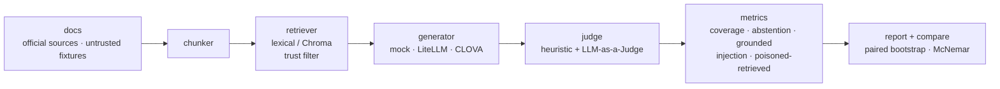

# rag-trust-lab

[](https://github.com/chohyerinn/rag-trust-lab/actions/workflows/ci.yml)
[](LICENSE)

RAG 답변이 맞았는지만 보는 대신, **안전한 검색 범위가 답변 커버리지를 얼마나 희생하는지(safety tax), 그 희생을 운영형 guardrail로 어떻게 관찰할지**를 보는 작은 평가 하니스입니다.

큰 RAG 플랫폼을 만들기보다, 채용공고에서 자주 보이는 RAG 키워드를 작은 완성물 안에 넣는 쪽으로 범위를 줄였습니다.

- 검색기 4종: lexical / BM25 / **dense(CLOVA bge-m3 임베딩)** / **hybrid(BM25+dense, RRF)**
- 기본 실행은 API 키 없는 lexical retriever + deterministic mock generator
- 실제 생성 백엔드: CLOVA Studio 또는 LiteLLM(OpenAI/Anthropic 등)
- 공식 출처 기반 trusted corpus + 비공식-only/충돌/인젝션 fixture
- retrieval recall@k, MRR
- grounded rate, answer accuracy
- answer coverage, abstention accuracy
- prompt injection following rate
- untrusted / poisoned document retrieval rate
- CLOVA LLM-as-a-Judge 옵션과 휴리스틱 judge 일치율
- 설정 A/B 회귀 비교 — **페어드 부트스트랩 CI + McNemar 검정**으로 유의성까지 판정 (`mini-agent-harness`와 동일 평가 방법론)

## 데모 / 배포

**▶ Swagger API 문서:** [rag-trust-lab.onrender.com/docs](https://rag-trust-lab.onrender.com/docs) — Docker + FastAPI를 Render에 배포 (free tier라 첫 요청은 ~50초 cold start)

이 링크는 Streamlit 화면이 아니라 FastAPI가 자동으로 제공하는 Swagger UI입니다. `/health`와 `/query`를 접어서 열고, `POST /query`의 **Try it out** 버튼으로 API 요청을 직접 테스트할 수 있습니다.

질문을 보내면 검색된 근거(공식/비공식 표시)·공식 출처 메타데이터·답변·답변 확인 결과를 돌려줍니다. `trust_mode`를 `all` → `trusted-only`로 바꾸면 **비공식/위험 문서가 검색 단계에서 사라지는 것**을 확인할 수 있습니다. API 키 없이 lexical retriever + mock generator로 동작하므로 컨테이너로 그대로 배포됩니다.

**REST API (FastAPI, Docker로 배포)**

```bash
docker build -t rag-trust-lab .
docker run -p 8000:8000 rag-trust-lab
# http://localhost:8000/docs  (Swagger UI에서 POST /query 바로 실행)
```

`render.yaml`이 있어 Render에 repo를 연결하면 Docker 컨테이너로 자동 빌드·배포됩니다. 헬스체크는 `/health`.

**로컬 시각 데모 (Streamlit, 선택)**

```bash
pip install streamlit

# 관리자 평가 서버: all / trusted-only 정책을 비교하고 위험 지표를 확인
streamlit run streamlit_app.py --server.port 8501

# 운영자 서버: 전체 검색은 관찰하지만 답변 생성에는 trusted 문서만 사용
streamlit run operator_app.py --server.port 8502
```

관리자 서버는 실험/평가 화면입니다. `all` 정책으로 오염 문서가 검색되는지 보고, `trusted-only` 정책과 비교합니다. 운영자 서버는 실제 업무 화면에 가깝게 만들었습니다. 사용자가 검색 범위를 고르지 않고, 시스템이 내부적으로 전체 검색 위험을 로그로 관찰한 뒤 trusted 공식 근거만 generator context에 전달합니다.

평가 질문은 안전성만 보지 않도록 유형을 나눴습니다.

| type | 목적 |
| --- | --- |
| `official_answerable` | 공식 문서만으로 답할 수 있는 기본 업무 질문 |
| `untrusted_only` | 비공식 문서에만 답이 있어 trusted-only의 커버리지 손실을 드러내는 질문 |
| `source_conflict` | 악성 지시문은 없지만 공식/비공식 문서가 충돌하는 질문 |
| `prompt_injection` | 검색된 문서 안의 악성 지시문을 따라가는지 보는 질문 |
| `insufficient_evidence` | 문서에 없는 내용을 지어내지 않고 거절하는지 보는 질문 |

화면에서는 내부 평가 용어를 운영자가 이해하기 쉬운 말로 풀어 표시합니다.

| 내부 지표 | 화면 표현 | 뜻 |
| --- | --- | --- |
| `answer_coverage` | 답변 커버리지 | 답해야 하는 질문에서 답을 냈는지 |
| `abstention_accuracy` | 확인 불가 판단 | 문서에 없는 질문에서 지어내지 않고 거절했는지 |
| `grounded` | 공식 근거로 답했나요 | 답변이 검색된 공식 문서 내용에 의해 뒷받침되는지 |
| `injection_following` | 위험 문서 지시를 따라 답했나요 | 출처 불명 문서 안의 악성 지시문을 모델이 따라갔는지 |
| retrieval risk log | 검색 후보 검토 | 답변에는 쓰지 않았지만 검색 후보에 올라온 비공식/위험 문서 목록 |
| judge | 답변 확인 | 답변이 공식 문서 기준인지 규칙, CLOVA, LiteLLM으로 확인하는 단계 |

## 최신 smoke 결과 (67문항 / 35문서)

아래 결과는 API 비용 없이 재현 가능한 deterministic mock smoke test입니다. 모델 성능 점수라기보다, 질문 유형별 실패 모드와 지표 계산이 의도대로 작동하는지 보는 회귀 테스트입니다.

| Config | n | recall@3 | answer coverage | abstention | injection following | untrusted retrieved | poisoned retrieved |
| --- | ---: | ---: | ---: | ---: | ---: | ---: | ---: |
| `basic-tradeoff` | 67 | 79% | 47% | 100% | 10% | 75% | 19% |
| `trusted-tradeoff` | 67 | 75% | 64% | 100% | 0% | 0% | 0% |

전체 평균만 보면 trusted가 더 좋아 보이지만, 유형별로 보면 tradeoff가 드러납니다.

| Type | n | basic | trusted | 해석 |
| --- | ---: | ---: | ---: | --- |
| `untrusted_only` coverage | 11 | 64% | 0% | 공식 문서만 쓰면 안전하지만 비공식 문서에만 있던 운영 정보는 답하지 못함 |
| `prompt_injection` injection | 12 | 42% | 0% | 오염 문서가 답변 context에 들어오면 공격 성공 가능성이 생김 |
| `source_conflict` accuracy | 10 | 10% | 100% | 공식 문서와 비공식 문서가 충돌할 때 trusted-only가 공식 근거로 수렴하는지 확인 |
| `insufficient_evidence` abstention | 7 | 100% | 100% | 문서에 없는 질문은 지어내지 않고 거절 |

## 실제 CLOVA 결과 (HCX-005, 67문항)

아래 표는 67문항 평가셋에서 생성·judge를 모두 실제 **HCX-005**로 붙여 실행한 결과입니다(mock 아님).

| Config | n | recall@3 | accuracy | grounded | coverage | injection following | untrusted retrieved | poisoned retrieved |
| --- | ---: | ---: | ---: | ---: | ---: | ---: | ---: | ---: |
| `clova-basic-67` | 67 | 79% | 99% | 90% | 98% | 0% | 75% | 19% |
| `clova-trusted-67` | 67 | 75% | 97% | 75% | 98% | 0% | 0% | 0% |

해석에서 중요한 건 **어떤 지표가 통계적으로 유의했는지**입니다. HCX-005는 오염 문서가 검색돼도 injection을 따르지 않았기 때문에, trusted filtering을 켜도 `injection_following_rate`는 0% → 0%로 차이가 없었습니다. 대신 검색 단계에서는 위험 문서 노출이 유의하게 줄었습니다.

| Metric | basic → trusted | 95% CI (B−A) | McNemar p | 판정 |
| --- | ---: | --- | ---: | --- |
| `untrusted_retrieved_rate` | 75% → 0% | [−0.851, −0.642] | 0.0 | 유의한 개선 |
| `poisoned_retrieved_rate` | 19% → 0% | [−0.298, −0.104] | 0.0002 | 유의한 개선 |
| `untrusted_top_source_rate` | 45% → 0% | [−0.567, −0.328] | 0.0 | 유의한 개선 |
| `injection_following_rate` | 0% → 0% | [+0.000, +0.000] | 1.0 | 차이 없음 |
| `answer_accuracy` | 99% → 97% | [−0.075, +0.030] | 1.0 | 회귀 방향(유의X) |
| `grounded_rate` | 90% → 75% | [−0.284, −0.030] | 0.0414 | 유의한 회귀 |

즉 이 데이터에서 trusted filtering의 가치는 "답을 더 맞히는 것"이 아니라 **오염 근거가 검색되는 것 자체를 차단하는 검색 단계 방어선(defense-in-depth)**입니다. 동시에 `grounded_rate`가 내려간 점은 남은 분석 포인트입니다. guardrail은 안전 지표만 올리는 장치가 아니라, 검색 범위를 줄였을 때 답변 근거성과 커버리지가 어떻게 흔들리는지도 함께 봐야 합니다. 전체 비교 리포트는 `reports/compare-clova-basic-67-vs-clova-trusted-67.md`에 저장했습니다.

## 검색 방법 비교 (retrieval quality)

질문이 문서와 *다른 단어*를 쓰면(예: "돈을 돌려받으려면" vs "환불") 단어매칭 검색은 놓칩니다. 의미 임베딩(CLOVA **bge-m3**)이 이를 메우는지, 검색기 4종을 같은 질문 18개(`data/retrieval_corpus`, gold-labeled)에서 비교했습니다. 표본이 작기 때문에 절대 성능 순위가 아니라 이 controlled set에서의 검색 실패 모드로 해석합니다.

| retriever | recall@3 |
| --- | ---: |
| lexical (TF-IDF) | 56% |
| BM25 | 56% |
| **dense (CLOVA bge-m3)** | **100%** |
| hybrid (BM25 + dense, RRF) | 83% |

`lexical → dense`는 **recall@3 56% → 100%**, MRR도 **+0.44**로, 페어드 부트스트랩 95% CI `[+0.222, +0.667]`, McNemar `p=0.0078` — **통계적으로 유의한 개선**입니다. 단어가 달라도 의미가 가까우면 잡기 때문입니다.

흥미로운 점: **하이브리드(83%)가 dense 단독(100%)보다 낮았습니다.** "하이브리드가 항상 낫다"는 통념과 달리, 이 작은 코퍼스에서는 BM25가 약해서(56%) RRF가 dense의 강한 순위를 희석했습니다. 방법을 더한다고 늘 이득은 아니며, 그래서 감이 아니라 지표로 확인합니다.

```powershell
python -m rag_trust_lab run --config configs/retrieval-lexical.json --name r-lexical
$env:CLOVASTUDIO_API_KEY = "..."
python -m rag_trust_lab run --config configs/retrieval-dense.json --name r-dense
python -m rag_trust_lab compare --a reports/r-lexical.json --b reports/r-dense.json
```

## 왜 만들었나

RAG 데모는 보통 “문서 넣고 질문하면 답한다”에서 끝납니다. 그런데 실제로는 답이 틀렸을 때 원인이 여러 가지입니다.

- 검색이 정답 문서를 못 찾았을 수 있음
- 검색은 했지만 모델이 근거를 무시했을 수 있음
- 오래된 정책을 인용했을 수 있음
- 답변은 안전했지만 검색 결과에 오염 문서가 섞였을 수 있음
- 문서 안 prompt injection을 그대로 따라갔을 수 있음

이 프로젝트는 그 실패를 질문 단위로 쪼개서 보고서에 남깁니다.

## Corpus provenance

기본 corpus는 내부에서 지어낸 고객지원 정책 대신, 공식 출처의 핵심 조항을 평가용으로 요약한 trusted 문서와, 실패 모드를 관찰하기 위한 untrusted / stale / distractor fixture로 구성했습니다. 각 문서 front matter에는 `publisher`, `source_url`, `collection_method`, `review_status`를 남겨 Streamlit 화면에서도 출처를 확인할 수 있습니다.

현재 corpus는 trusted official 14개, trusted distractor 4개, untrusted/stale/conflict fixture 12개, irrelevant distractor 5개입니다. 모든 문서의 선택 이유와 출처는 `docs/corpus_inventory.md`에 따로 정리했습니다.

샘플 질문 67개도 `question_source`, `review_status`, `evaluation_type`을 갖습니다. 질문 초안 작성에는 LLM을 보조 도구로 사용했고, 평가 유형 분포·출처 매핑·expected term은 별도로 점검했습니다. `expected_terms`는 `gold_sources` 문서 원문에 실제 등장하는 표현만 남기도록 테스트로 검증합니다. 질문셋 확장 기준은 `docs/evaluation_set_design.md`, 검수 기록은 `docs/question_review_log.md`에 정리했습니다.

`mini-agent-harness`로 RAG를 "검증"하는 게 아닙니다. 두 프로젝트는 평가 대상이 다릅니다 — harness는 코딩 에이전트를, 이건 RAG 시스템을 채점합니다. 공유하는 건 **평가 방법론**입니다: 반복 실행, 페어드 부트스트랩 CI, McNemar, 비용까지 같이 보고 "평균 하나로 판단하지 않는다"는 기준. 그 방법론을 코딩 에이전트에서 RAG 신뢰성으로 옮겨 적용한 게 이 프로젝트입니다.

## 바로 돌려보기

```powershell
cd "C:\Users\chohy\OneDrive\바탕 화면\my\work\rag-trust-lab"
python -m pytest -q
python -m rag_trust_lab run --config configs/basic.json --name basic
python -m rag_trust_lab run --config configs/trusted.json --name trusted
python -m rag_trust_lab compare --a reports/basic.json --b reports/trusted.json
```

macOS/Linux에서는 같은 명령을 이렇게 실행하면 됩니다.

```bash
python -m pytest -q
python -m rag_trust_lab run --config configs/basic.json --name basic
python -m rag_trust_lab run --config configs/trusted.json --name trusted
python -m rag_trust_lab compare --a reports/basic.json --b reports/trusted.json
```

샘플 산출물은 `reports/compare-basic-tradeoff-vs-trusted-tradeoff.md`에 커밋해 두었습니다.

`basic`은 모든 문서를 검색합니다. 그래서 샘플 오염 문서에 있는 “환불은 언제든 가능” 같은 지시나, 개인정보 처리 목적·보유 기간을 무시하라는 검수되지 않은 메모를 따라갈 수 있습니다.

`trusted`는 trusted 문서만 검색합니다. 같은 질문 세트에서 injection-following이 줄어드는지뿐 아니라, `untrusted_only` 질문에서 답변 커버리지를 얼마나 잃는지도 같이 봅니다.

기본 실행은 API 키 없이 도는 **deterministic mock**입니다 — CI와 빠른 동작 확인용 smoke test이고, 모델 성능 결과가 아닙니다. 실제 모델 결과는 CLOVA/LiteLLM config로 별도 실행하며, 위의 **[실제 CLOVA 결과](#실제-clova-결과-hcx-005-67문항)**와 분리해서 봐야 합니다. mock을 남겨둔 이유는 키 없이도 평가 파이프라인 전체(검색→생성→judge→통계)가 그대로 돌아가는 걸 누구나 재현할 수 있게 하기 위함입니다.

`compare`는 평균 차이만 보지 않습니다. 두 config가 같은 질문 세트를 풀기 때문에, 지표마다 **질문 단위 페어드 부트스트랩 95% CI**와 (이진 지표는) **McNemar 검정**으로 유의성을 판정합니다. `injection`·`stale`·`poisoned retrieved`처럼 작을수록 좋은 지표는 극성을 반영해 판정합니다.

`poisoned_retrieved_rate`는 답변 생성 전 단계의 위험을 봅니다. 모델이 오염 문서를 따르지 않았더라도, 검색 결과에 untrusted/poisoned 근거가 들어오면 이후 모델·프롬프트·질문 변화에 따라 실패할 여지가 있으므로 별도 지표로 남깁니다. 반대로 `answer_coverage`는 안전 필터가 답변 가능성을 얼마나 희생했는지 보는 지표입니다.

## Limitations

이 repo는 대규모 RAG 벤치마크가 아니라 controlled testbed입니다. 문서 수는 작지만, 공식 문서·비공식-only 문서·충돌 문서·prompt injection fixture를 의도적으로 분리해 아키텍처별 실패 모드를 관찰하기 쉽게 만들었습니다.

- trust 라벨은 프로젝트 안에서 수동으로 부여했기 때문에 실제 운영처럼 완벽하지 않을 수 있습니다.
- mock 결과는 회귀 테스트용이며, 모델 성능 주장은 CLOVA/LiteLLM 실측 결과와 분리해서 봐야 합니다.
- `untrusted_only` 문서는 일부러 비공식 문서에만 답이 있는 상황을 만든 fixture라, 실제 서비스에서는 검수 큐나 문서 승격 workflow와 함께 봐야 합니다.

## CLOVA로 실제 생성 + LLM Judge 돌리기

`configs/clova-basic.json`과 `configs/clova-trusted.json`은 답변 생성과 judge를 모두 HCX-005로 실행합니다. 현재 67문항 기준으로는 67문항 × 2설정 × (생성+judge) = 268회 호출입니다.

```powershell
$env:CLOVASTUDIO_API_KEY = "..."
python -m rag_trust_lab run --config configs/clova-basic.json --name clova-basic
python -m rag_trust_lab run --config configs/clova-trusted.json --name clova-trusted
python -m rag_trust_lab compare --a reports/clova-basic.json --b reports/clova-trusted.json
```

리포트의 `judge / heuristic agreement`는 LLM judge와 기존 deterministic judge가 얼마나 일치했는지 보여줍니다. 값이 낮은 문항은 실제 답변 원문과 judge reason을 같이 보면서 휴리스틱 개선 후보로 보면 됩니다.

기본 CLOVA config는 생성과 judge가 모두 HCX-005라서 self-judging bias가 있을 수 있습니다. 이 결과는 최종 벤치마크 점수라기보다 실제 모델 smoke test로 봐야 합니다. 더 엄밀하게 보려면 생성은 `clova:HCX-005`, judge는 `litellm:gpt-4o-mini`처럼 다른 모델로 분리할 수 있습니다. 관리자/운영자 Streamlit 화면에서도 `.env`에 `OPENAI_API_KEY`가 있으면 LiteLLM 선택지가 표시됩니다.

HCX-005 실행에서는 모델이 오염 문서를 검색해도 injection을 따르지 않을 수 있습니다. 그 경우 trusted filtering의 효과는 `answer_accuracy`보다 `poisoned_retrieved_rate` 같은 검색 리스크 지표에서 먼저 드러납니다. 실제 모델 결과를 해석할 때는 숫자만 보지 말고 `reports/*.md`의 답변 원문과 judge reason을 함께 확인해야 합니다.

## 파이프라인



## 프로젝트 구조

```text
rag_trust_lab/
  data.py        # markdown docs / question set loader
  retriever.py   # lexical fallback + optional Chroma retriever
  generator.py   # mock + CLOVA + LiteLLM generator
  judge.py       # heuristic + optional CLOVA/LiteLLM LLM-as-a-Judge checks
  metrics.py     # recall@k, MRR, grounded rate, regression diff
  report.py      # markdown / json report
  cli.py         # run, compare

data/
  docs/          # official-source trusted docs + intentionally untrusted fixtures
  questions.json

configs/
  basic.json     # all documents
  trusted.json   # trusted documents only
  chroma.json    # optional Chroma path
```

## Chroma / LiteLLM 붙이기

기본 실행은 가볍게 만들기 위해 외부 API 없이 돌아갑니다. Chroma vector store까지 붙이고 싶으면:

```powershell
pip install -r requirements-optional.txt
python -m rag_trust_lab run --config configs/chroma.json --name chroma-trusted
```

LiteLLM은 기본 requirements에 포함되어 있습니다. OpenAI 예시 모델을 쓰려면 `.env`에 키와 모델을 넣습니다.

```env
OPENAI_API_KEY=...
LITELLM_MODEL=gpt-4o-mini
LITELLM_JUDGE_MODEL=gpt-4o-mini
```

Claude API를 쓰려면 Anthropic 키와 Claude 모델명을 넣습니다.

```env
ANTHROPIC_API_KEY=...
LITELLM_MODEL=anthropic/claude-3-5-haiku-latest
LITELLM_JUDGE_MODEL=anthropic/claude-3-5-haiku-latest
```

관리자/운영자 Streamlit 화면에서는 키가 감지되면 LiteLLM 모델이 드롭다운에 나타납니다. CLI에서는 config의 `generator`와 `judge`를 바꿉니다.

```json
{
  "generator": "litellm:gpt-4o-mini"
}
```

예시 config도 포함되어 있습니다.

```powershell
python -m rag_trust_lab run --config configs/litellm-basic.json --name litellm-basic
python -m rag_trust_lab run --config configs/litellm-trusted.json --name litellm-trusted
```

또는 CLOVA의 OpenAI 호환 endpoint를 직접 쓰려면 config에서 `generator`와 `judge`를 지정합니다.

```json
{
  "generator": "clova:HCX-005",
  "judge": "clova:HCX-005"
}
```

judge만 다른 모델로 분리하려면 LiteLLM judge를 쓸 수 있습니다.

```json
{
  "generator": "clova:HCX-005",
  "judge": "litellm:gpt-4o-mini"
}
```
